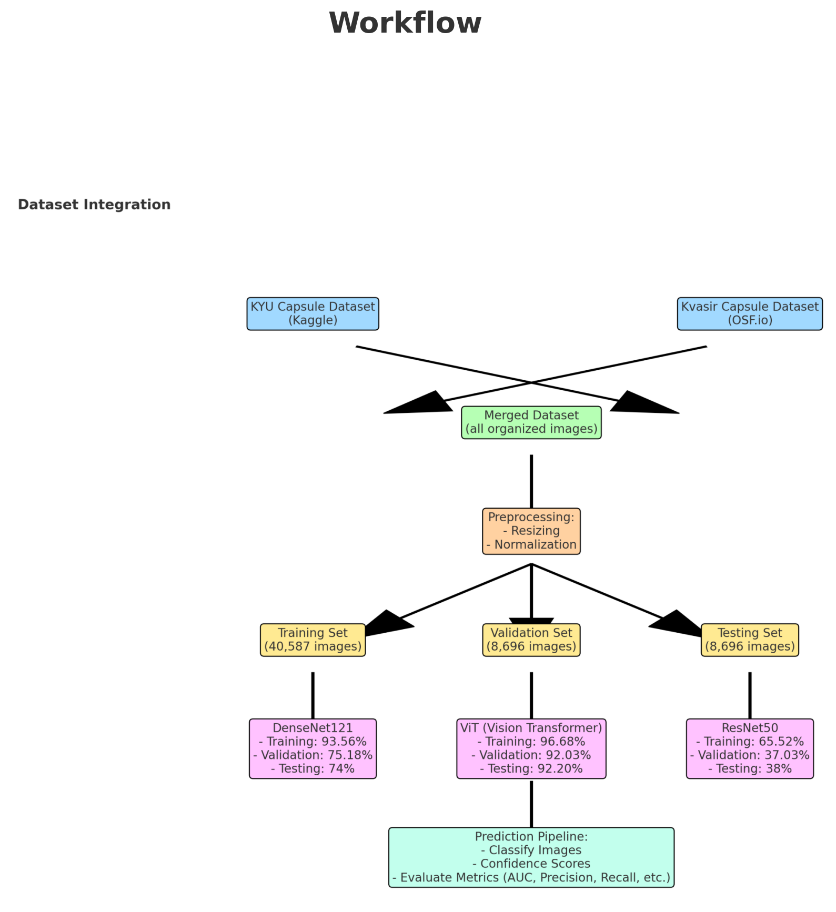
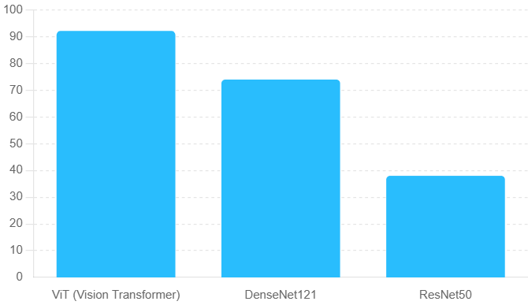
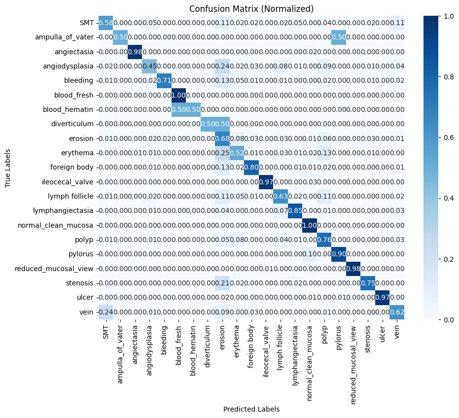

# Automated Capsule Endoscopy Recognition Using Transformers
Establishing an AI model  for automated Capsule Endoscopy recognition based on Transformers

---

## **Table of Contents**
1. [Abstract](#abstract)
2. [Datasets](#datasets)
   - [SEE AI Dataset (Kaggle)](#see-ai-dataset-kaggle)
   - [Kvasir-Capsule Dataset (OSF)](#kvasir-capsule-dataset-osf)
3. [Workflow](#workflow)
4. [Model Performance](#model-performance)
   - [Comparison Table](#comparison-table)
   - [Comparison Chart](#comparison-chart)
   - [Confusion Matrix](#confusion-matrix)
5. [Detailed Observations](#detailed-observations)
6. [Key Achievements](#key-achievements)
7. [Future Work](#future-work)
8. [Prerequisites](#prerequisites)
9. [License](#license)

---

## **Abstract**
Capsule endoscopy (CE) is a critical diagnostic tool for identifying small bowel diseases; however, the vast number of images generated presents a significant challenge for manual review by physicians, leading to an increased risk of missed diagnoses. This study aims to address these challenges by developing a state-of-the-art artificial intelligence (AI) model and application leveraging advanced deep learning techniques based on Transformer architectures. The proposed AI system is designed to automatically recognize various lesions in small bowel capsule endoscopy images, providing an automated pipeline for Capsule Endoscopy analysis. By focusing on achieving high diagnostic precision, the model seeks to reduce the workload on physicians, enhance diagnostic accuracy, and minimize the likelihood of missed abnormalities.

---

## **Datasets**
### SEE AI Dataset (Kaggle)
- [Link to Dataset](https://www.kaggle.com/datasets/capsuleyolo/kyucapsule)
- Annotated capsule endoscopy images.

### Kvasir-Capsule Dataset (OSF)
- [Link to Dataset](https://osf.io/dv2ag/)
- Additional images for improved diversity and volume.

### Dataset Statistics
- **Training Set:** 40,587 images
- **Validation Set:** 8,696 images
- **Testing Set:** 8,696 images
- **Classes:** 21 distinct categories of endoscopic findings

---

## **Workflow**
1. **Dataset Integration**
   - Merging datasets for uniform structure and consistency.
2. **Preprocessing**
   - Resizing images to **224x224 pixels**.
   - Normalizing pixel values for consistent inputs.
3. **Data Splitting**
   - Creating training, validation, and testing subsets.
4. **Model Training**
   - Training and evaluation of **Vision Transformer (ViT)**, **DenseNet121**, and **ResNet50** models.
5. **Evaluation**
   - Metrics: **Accuracy**, **Precision**, **Recall**, **F1-Score**, and **AUC**.

### Workflow Diagram

---

## **Model Performance**

### Comparison Table
| **Model**          | **Training Accuracy** | **Validation Accuracy** | **Test Accuracy** | **Precision** | **Recall** | **F1-Score** | **AUC** |
|---------------------|-----------------------|--------------------------|-------------------|---------------|------------|--------------|---------|
| **Vision Transformer** | 96.68%               | 92.03%                   | 92.20%            | 0.92          | 0.92       | 0.92         | 0.99    |
| **DenseNet121**       | 93.56%               | 75.18%                   | 74.00%            | 0.81          | 0.75       | 0.78         | 0.85    |
| **ResNet50**          | 65.52%               | 37.03%                   | 38.00%            | 0.45          | 0.37       | 0.40         | 0.55    |

### Comparison Chart

### Confusion Matrix
The normalized confusion matrix highlights classification performance across 21 image categories.

---

## **Detailed Observations**
1. **Vision Transformer (ViT):**
   - Achieved the highest performance with a **test accuracy of 92.20%**.
   - Demonstrates excellent classification capabilities with an **AUC close to 1** for most classes.
   - Superior at capturing spatial and contextual information compared to CNN-based models.

2. **DenseNet121:**
   - Showed moderate performance with a **test accuracy of 74.00%**.
   - Better generalization ability compared to ResNet50, but lacks the contextual understanding provided by the ViT architecture.

3. **ResNet50:**
   - Underperformed significantly, with a **test accuracy of 38.00%**.
   - Struggled to handle the complexity of the dataset and failed to generalize effectively.
   - Lower classification capabilities with reduced precision and recall across multiple classes.

---

## **Key Achievements**
- **Vision Transformer (ViT)** outperformed traditional CNNs, achieving:
  - **Training Accuracy:** 96.68%
  - **Validation Accuracy:** 92.03%
  - **Test Accuracy:** 92.20%
- High diagnostic precision with **AUC: 0.99**.

---

## **Future Work**
1. **Fine-Tuning:** Explore advanced hyperparameter optimization and data augmentation techniques.
2. **Deployment:** Develop a real-time inference pipeline for clinical applications.
3. **Explainability:** Implement attention map visualizations to interpret model predictions.

---

## **Prerequisites**
The following libraries are required to run this project:

- **Python** 3.8+
- **Deep Learning Frameworks:**
  - TensorFlow
  - PyTorch
  - TorchVision
- **Libraries:**
  - Transformers (e.g., Hugging Face `transformers`)
  - NumPy
  - Pandas
  - Matplotlib
  - Scikit-Learn
  - Seaborn
  - PIL (Pillow)
  - shutil
- **Other Tools:** pip for package installation.

---

## License

This dataset used in this project is licensed under the **Attribution 4.0 International (CC BY 4.0)** license.
For more information, visit the [Creative Commons License page](https://creativecommons.org/licenses/by/4.0/).

---
